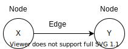

# Breadth-First Search (BFS)
The algorithm to solve a shortest-path problem is called *breadth-first search*.
The breadth-first search (BFS) is a graph algorithm.
* BFS allows you to find the shortest distance between two things, e.g., from node A to node B.
* BFS helps answer whether there is a path from node A to node B.

Steps:
1. Model the problem as a graph.
2. Solve the problem using BFS.


BFS algorithm implementation:
1. Maintain a queue as a list to check items.
2. Pop an item off the queue.
3. Check if the item is the target.
4. 
   - If matches, the search is over.
   - If not, add all their neighbors to the queue.
5. Loop back to 2.
6. If the queue is empty, there is no item matching the target in the network.

*Note*: Mark the searched items to avoid unnecessary work and infinity loop.


***Running time***:

If you search the entire network, **O(number of edges)**.

Adding one item to the queue takes constant time **O(1)**. 
Thus, adding all the items takes **O(number of items)** in total.

As a result, BFS takes **O(V + E)** where V for number of vertices and E for number of edges.


## Graph
A graph models a set of connections. Graphs are a way to model how different things are connected to one another.

Graphs are made up of nodes and edges. 
A node can be directly connected to many other nodes. Those nodes are called its *neighbors*.



*Note*: A *tree* is a special type of graph where no edges ever point backward.

The data structure *queue* will allow us to search the target in the order that they are added.
### Queue
Queues do not allow to access random elements in the queue. A Queue has *enqueue* (push) and *dequeue* (pop) operations.
The queue is called a *FIFO* data structure: First In, First Out.


To express a relationship between nodes, the data structure *hash table* can be used.
### Hash table
The order we add the key-value pairs in the hash table does not matter. Hash tables have no ordering.

* A *directed graph*: the relationship is only one way, i.e. arrow points from a node to a node.
The relationship follows the direction of the arrow.
* An *undirected graph*: both nodes are each other's neighbors, i.e. no arrows. 
The relationship goes both ways.

*Code example* - a direct graph structure to express relationships between nodes.
```python
graph = {}
graph["narae"] = ["asim", "tom", "yongdi"]
graph["asim"] = ["sachin", "shin"]
graph["yongdi"] = ["yash"]
graph["tom"] = ["sachin", "yash"]
graph["dermot"] = []
graph["shin"] = []
graph["yash"] = []
graph["sachin"] = []
```


## Example
Assume we are looking for someone via Facebook.

So I search all my friends first. If not found yet, I need to search through my friends' friends.
Thus, add all their friends to the list each time I search for someone from the list.
With the algorithm, I can search my entire network until I find the person. This is BFS.

This algorithm also checks first-degree connections before second-degree connections, and so on.
For example, we add a new search list at the bottom of the list as we search from the top of the list.
As a result, BFS not only finds a path from A to B, but also it finds the shortest path.


## Use cases
- Write a checkers AI that calculates the fewest moves to victory.
- Write a spell checker, i.e., fewest edits from your misspelling to a real word, e.g., READED -> READER by one edit.
- Find the doctor closest to you in your network.


## References
* Grokking Algorithms
